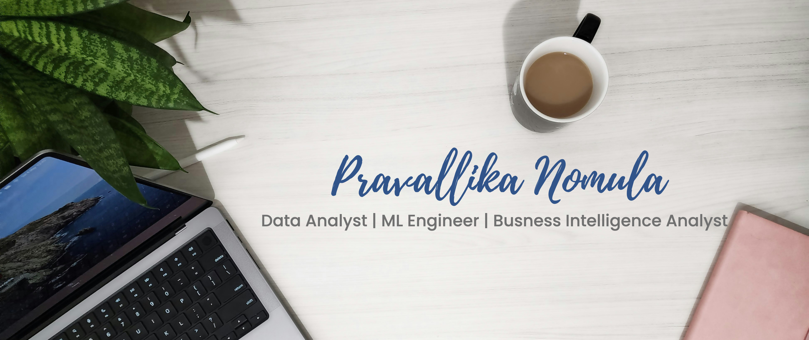

  <em>Data & Machine Learning Enthusiast | Turning curiosity into insight 🔍</em>

---

### 🧠 About Me
A curious problem-solver who enjoys exploring the intersection of **data, code, and creativity**.  
I analyze, clean, and visualize data to tell meaningful stories — and occasionally automate the boring stuff 🤖.  
Currently growing in **data analytics, applied ML, and full-stack development**.

---

### 📊 What I Do
- Querying, cleaning, and transforming data using **SQL** and **Python (Pandas, NumPy)**  
- Building interactive dashboards and reports using **Tableau** and **Power BI**  
- Automating workflows and data validation tasks using **Python scripting**  
- Exploring **machine learning** and **LLMs** for real-world insights  
- Designing efficient **data pipelines** and auditing tools for structured analysis  

---

### 🛠️ Tools & Technologies

**Languages:** Python, SQL, JavaScript  
**Databases:** PostgreSQL, MySQL, SQL Server  
**Visualization:** Tableau, Power BI, Looker Studio  
**Other:** Excel, Google Sheets, Docker, Git, Streamlit, Flutter  

---

### 💡 Fun Facts
- 🎧 Debugging fuel: Soft indie playlists & calm vibes
- 🧩 Love solving puzzles and brain teasers — anything that makes me think twice
- ➗ Math is my comfort zone — there’s beauty in logic and structure
- 🍛 Favorite side project: an Electron-based **Biryani Timer** (yes, really!)  
- 🧠 Motto: *"Curiosity is the best algorithm."*  

---

### 👋🏻 Connect with Me

 

  - <a href="https://www.linkedin.com/in/pravallika-nomula-78340b2ab" target="_blank">Linkedin</a>

---

  <em>“Turning data into stories, and ideas into reality.” 🌟</em>

